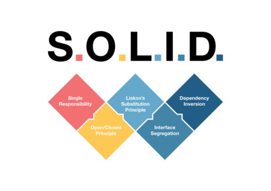

<h1 align="center">SOLID in Node.js<h1>



<h2 align="center">This project is to study how to structure SOLID applications within Node.<h2>

### This project doesn't apply every SOLID principle, but it's structured to
### work better with Node.

# Features

* NodeJS
* Express

# Installation

* `git clone https://github.com/ThiagoBastosN/SOLID-principles-with-nodejs.git`
* `cd solid-principles-with-nodejs`
* `npm install`
* Inside `external/implementations/MailTrap.ts` change `this.transporter` configurations to your mailtrap configurations.
* `npm run start`

# Structure

Inside `src` is where all the code resides. Inside `src` there are 5 folders: `entities`, `external`,
`repositories`, `routes`, `useCases` and two files: `app.ts` and `server.ts`.

`app.ts` creates the express app and `server.ts` simply starts the server at port 3000.

## `Entities` directory

Inside `entities` there will be the entities of our application. They dictate on how we'll store data
into the database.

`User.ts` is the only entity avaliable and it shows how we'll store users into our database.

## `External` directory

Inside `external` we should put code that is related to external services our application will communicate besides database services. There you'll find a `implementations` folder and a `IMailSender.ts`.

The `IMailSender.ts` is an interface that tells the format all mail sender external services should
implement.

The `implementations` folder will contain all concrete external implementations our application will have. `MailTrap.ts` is the only implementation avaliable.

## `Repositories` directory

Inside `repositories` we'll have all database related code. Inside `repositories` you'll find, again, a `implementations` folder and a `IUserRepository.ts`.

The `IUserRepository.ts` is an interface that tells all functions a user repository collection/table should have.

The `implementations` folder will contain all concrete database implementations our application will have. `MockDB.ts` is the only implementation avaliable.

## `Routes` directory

Inside `routes` we have all routes our application has avaliable.

The only route avaliable is `createUserRoute.ts`, that uses the `createUserController`.

To access the create user route you'll need to send a POST request to `http:localhost:3000/createUser`
with a JSON body as follows:
```javascript
{
    name: data,
    password: data,
    email: data
}
```

## `UseCases` directory

Inside `useCases` is where we should put the logic of our application. There we have the `CreateUser` folder.

In the `CreateUser` folder we have 4 files: `CreateUserController.ts`, `CreateUserDTO.ts`,`CreateUserLogic.ts` and `index.ts`.

`CreateUserLogic.ts` contains all the logic related to creating a user.

`CreateUserController.ts` executes the create user logic we created at `CreateUserLogic.ts`.

`CreateUserDTO.ts` is a Data Transfer Object. We use it so the data `CreateUserLogic.ts` receives is abstract, and not a `CreateUserController.ts` implementation.

And finally, `index.ts` is the actual implementation of the code, where we pass all the necessary dependencies to the code work all together.
